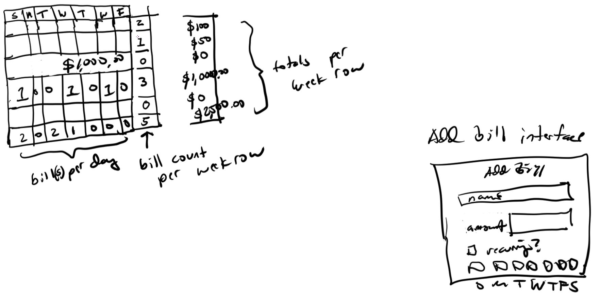

# About
This is part of some finance app I designed a while back. The main idea behind this is that per week of a given month, you know how much money you need.
Which this isn't really the type of mindset you want to be in eg. have months/years of savings but still... it's nice to think in your mind like "I'm set this week".
I had actually built a calendar from the ground up before using PHP/JavaScript but I'm just going to use [FullCalendar](https://fullcalendar.io/docs/react) here although the UI update will be interesting, I think I can pull it off.
Just have to match FullCalendar's dimensions. I'm also uncertain about using the React version vs. just plain JavaScript. Unsure because I'm not a pro at React.

# Design
These are the main interfaces, it's not really anything special just a way to "quantify reality" ha eg. a budget.

# Thoughts
I'm mostly using FullCalendar for managing the days, I'm not really using any of it's built in stuff other than cell/week selectors. I'm barely using the capability of the app eg. being able to write notes and what not. I'm just going to put a number(bill count) per days/week row.
