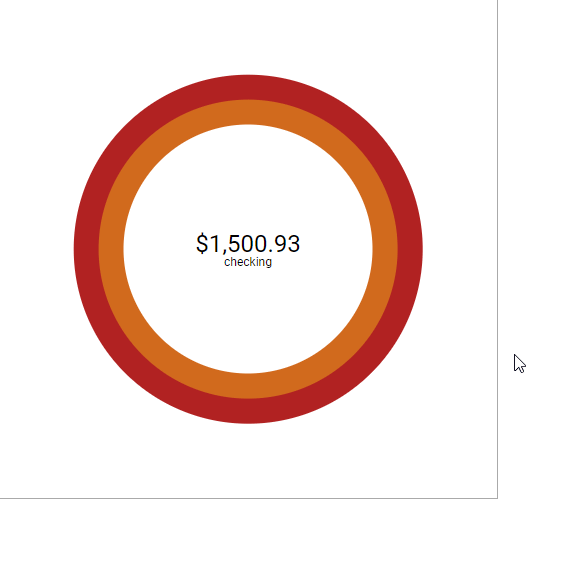

### Dev Notes

##### 01/03/2019
I'm going to work on the upcoming bills. Somewhat distracted right now but will try.
Ahh man date sorting hmm... may be a good reason to use moments or something, we'll see.
Yeah I don't think this is happening, I'm burnt...

##### 01/02/2019
Damn this circle thing is hard. I mean if it was fixed I could make it easy, but I would like to make it grow... although I suppose at some point it would not be useable. Maybe cap it. But it has to have a dynamic z-index and unique selectors.

So this is funcitonal but it's not dynamicly built and the state setting is kind of shit but whatever, MVP baby.

