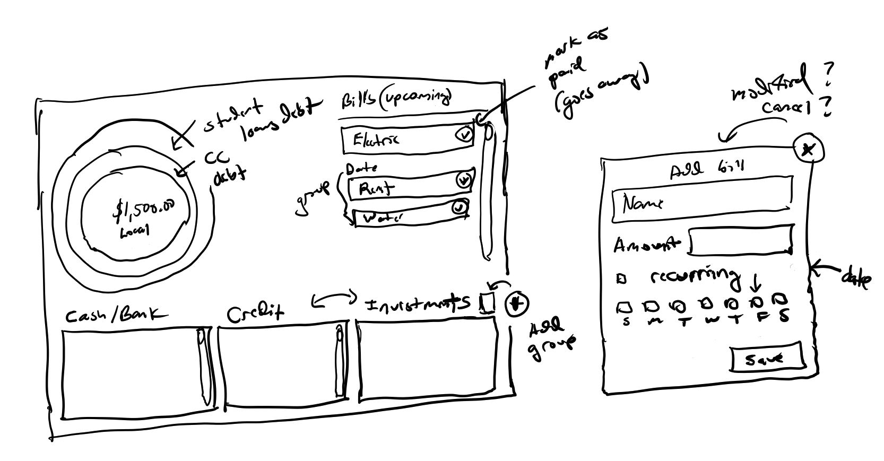

## About
This has three main things at this time:
* local/maxima funds(concentric colored circles)
  * eg. in the grand scheme have negative net worth(student loans) but locally my CC's are all paid off/have positive balance in bank account.
* upcoming bills(by ascending date, recurring)
  * can check them off as paid off in month, groups by same day or possibly week
* groups in the bottom
  * I currently have several credit cards and I have spreadsheets where I meticulously track their balances like a crazy person

## Initial Design

Each sub component does have more complexities though eg. "add a new cash entry" eg. debit... that's hard... it would not be as dynamic as it seems the input interface because certain things have more fields like a CC has APR, balance, minimum due, etc... and a bank account is just a balance. Not entirely sure yet how this will work the bottom part regarding dynamic inputs.

## Purpose
This is basic financial overview for me. I could easily "spit this out" regarding UI but the state management in React for me is challenging(to do it right). But I will build it that way eg. component-based.